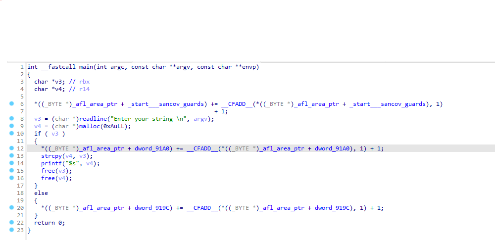
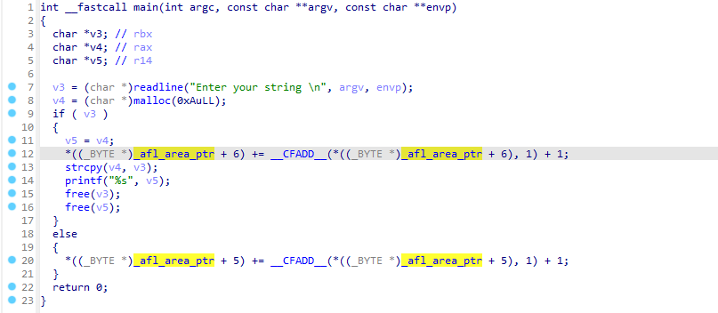
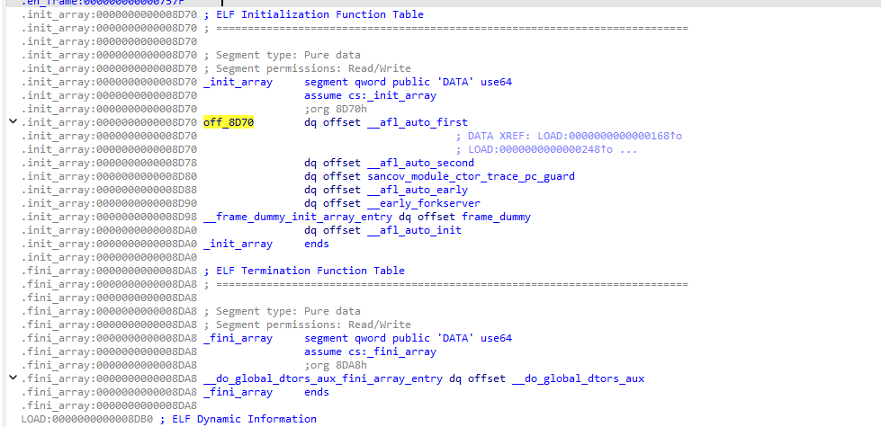
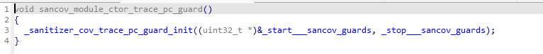

# От автора 
Написание этой статьи было вызвано отсутствием комплексных материалов о структуре фаззера AFL++ на русском языке, а также необходиомтью устранить собственные пробелы в знаниях.

На протяжении всей статьи будут приведены ссылки на исходный код, который относится к последней стабильной версии AFL++ 4.30. Всё, что описано в статье, основывается именно на этой версии, но с высокой вероятностью будет актуально как для более старых, так и для более новых версий, так как затрагивает основные механизмы работы этого фаззера.

## Введние 
AFL (American Fuzzy Lop) и его современная версия AFL++ — это один из самых мощных инструментов для поиска уязвимостей в программах. Этот фаззер используется для тестирования разных типов бинарных файлов и стал стандартом фаззинга.

AFL++ — это не просто генератор случайных данных. Он использует метод фаззинга, основанный на покрытии кода (`coverage-based fuzzing`). Основная идея этого подхода заключается в отслеживании тех участков программы, которые исполняются при подаче определенных данных на вход программы. Таким образом, можно понять, какие входные данные активируют конкретные части программы. На основе этой информации AFL++ формирует базу данных входных данных, которая постепенно покрывает весь код программы, а не только ее основные или часто используемые участки - этот процесс называется *мутацией*. Это позволяет находить ошибки даже в тех местах, которые обычно остаются без внимания.


Давайте рассмотрим работу AFL++ на конкретном пример кода:
```C
int main(){
	input = get_in(); функция-заглушка, для получение ввода из файл / stdin или каким-то другим способом.
	if(condition_A){
		...code_A...
	}else if(condition_B){
		...code_B ..
	}else{
		...code_C...
	}
	return 0;
}
```
Предположим, у нас есть определенный набор данных, подав который с помощью функции `get_in()`, мы выполним участок кода `code_C`. 
> Выполнение уникакальной трассы кода будем называть `edge` (или ребро). 
>
> Набор данных, котрый приводит к открытию нового `edge` будем называть `seed` (сид).
> 
> Совокупность `seed'ов` будем называть `corpus` (корпус).
> 
> `Seed`, который приводит к аварийному завершению исследуемой программы, будем называть `crash` (краш / падение).\
> 
> `Seed`, который приводит к зависманию исследуемой программы, будем называть `hangs` (зависание)
> 
>  Совокупность сидов, крашей и зависаний (выходные данные фаззинга), будем называть `артефактами фаззинга`

Теперь предположим, что мы каким-то образом изменяем `seed` (напоминаю, в фаззинге этот процесс называется `мутацией`), получая новый входной файл — `seed_A`. При вводе `seed_A` программа выполняет секцию `code_A`, который ранее не выполнялся. Это новое поведение. 
Зная, что `seed_A` приводит к выполнению нового участка кода `code_A`, мы можем сохранить `seed_A` в нашем корпусе для дальнейших мутаций, чтобы исследовать другие части кода.
Именно этот итеративный процесс поиска новых ребер, за счет изменения данных и работы с ними делает фаззинг на основе покрытия таким мощным подходом.


### Архитектура afl-fuzz

Типичная команда запуска фаззера выглядит примерно так:
```bash
afl-fuzz -i in -o out -- ./bin [@@]
```
Немного подробнее про опции:
- `-i` - путь до директории с начальным (входным) корпусом данным (**Важно!** наборы данных в этой папке не должны приводить к падению или зависанию программы);
- `-o` - путь, куда будут сохраняться выходные данные фаззера (артефакты)
- `--` такими символами разграничиваются опции утилиты `afl-fuzz` и опции исследуемой программы;
- `bin` - путь до исследуемой программы
- `[@@]` - специальная опция afl-fuzz. При отсутствии символов `@@` фаззер будет подавать данные на программу из потока. Если запустить `afl-fuzz`, выставив символы `@@`, то на вход исследуемой программы сиды будут подаваться как файлы.

Итак, немного глубже рассмотрим то, как происходит запуск и работа утилиты `afl-fuzz`:

Когда запускается `afl-fuzz`, выполняется серия функций инициализации. После этого `afl-fuzz` создает дочерний процесс с помощью `fork`. Дочерний же процесс выполняет   запуск исслудемой программы (цели)  с помощью функции `exec`. Однако, фаззинг тестирование **не** начинается в дочернем процессе. Вместо этого дочерний процесс останавливается прямо перед вызовом функции `main` и становится `forkserve'омr`.

Этот `forkserver` создаёт новый дочерний процесс (дочерний процесс дочернего процесса - внука), и уже в этом процессе (внуке) запускается фаззинг тестирование. 
Такой подход связан с тем, что `fork` работает гораздо быстрее, чем `exec`, поэтому резонно запускать фаззинг именно в процессе - внуке, а не в главном или дочернем процессе, ведь такой подход позвляет повысить скорость фаззинг тестирования, что очень важно. 
> Процесс фаззинг тестирования базируется на постоянном перезапуске исследуемой программы (кроме `persistant mode`, но об этом ниже). 
> Зачастую количество запусков исследуемой программы при грамотно написанной фаззинг обертке и компиляции с механизмами `llvm` достигает сотен тысяч в секунду.


Чтобы `afl-fuzz` мог взаимодействовать с бинарным файлом исследуемой программы (будем его так же называть *целевым файлом*), создаются два канала (`pipe`): управляющий канал (`control pipe`) и канал статуса (`status pipe`).

- Управляющий канал находится по адресу `FORKSRV_FD` и используется для отправки сообщений управления в целевой бинарный файл. Этот канал доступен для чтения только целевому бинарному файлу и для записи только `afl-fuzz`.
- Канал статуса находится по адресу `FORKSRV_FD+1` и используется для передачи статусов обратно в `afl-fuzz`. Этот канал доступен для записи только целевому бинарному файлу и для чтения только `afl-fuzz`.

*Управляющий канал используется для передачи управляющих сообщений в целевой бинарный файл.*
*Канал статуса — для отправки ответных сообщений в `afl-fuzz`.*

Теперь, когда у нас есть общее представление о том, как запускается `afl-fuzz`, давайте более подробно разберём почему AFL++ `coverage-based`.

## Инструментация и сбор покрытия кода
Для работы AFL++ бинарный файл должен быть скомпилирован специальным компилятором AFL++. При компиляции происходит инструментация бинарно файла специальными инструкциями AFL++. Это необходимо для того, чтобы фаззер мог отслеживать открытие новых ребер с помощью мутированных данных при фаззинг тестировании. Это и назыается покрытием кода.
Факт открытия нового ребра сохраняется в специальный массив, который называется "картой покрытия" (подробнее о нём будет ниже).

В настоящее время AFL++ позволяет использовать различные системы инструментации кода для дальнейшего сбора покрытия, но наиболее распространнеными являются `PCGUARD` и `LTO`.
Получить доступ к этим инструментациям можно с помощью базовых компиляторов AFL++:
- `PCGUARD` инструментация предоставляется компилятором `afl-clang-fast`.
- `LTO` инструменацтия предоставляется компилятором `afl-clang-lto`.

Об особенностях компиляции и выборе подходящего компилятор подробно рассказывается в [документации](https://github.com/AFLplusplus/AFLplusplus/tree/v4.30c/docs) на AFL++. 
Если коротко, то изменения компилятора так же влияет и на скорость фаззинга. 
Выбор способа инструментирования кода по скорости от лучшего к худшему:
```
LTO (afl-clang-lto) -> LLVM  (afl-clang-fast) -> GCC_plugin (afl-gcc-fast) -> GCC (afl-gcc)
```

Так же различные компиляторы отличаются не только скоростью фаззинга, но и требованием к версии `clang` и `llvm`.

Теперь давайте рассмотрим инструментацию кода на практике. 
Пусть у нас есть простейшая программа, которая принимает и обрабатывает данные из потока ввода:

```C
#include <stdlib.h>
#include <string.h>
#include <stdio.h>
#include <readline/readline.h>
#define SIZE 10

int main()
{
        char *str = readline("Enter your string \n");
        char * array = malloc(SIZE * sizeof(char));
        if(str == NULL)
                return 0;
        strcpy(array, str);
        printf("%s", array);
        free(str);
        free(array);
        return 0;
}
```

Скомпилируем её с инструментацией `PCGUARD`
```bash
afl-clang-fast main.c -lreadline -o bin_fast
```

И декомпилируем получившийся исполняемый файл в IDA PRO:




Внимательный читатель обратит внимание на появищиеся конструкции, которые сопровождает переменная `_afl_area_ptr`.
Помните выше мы ввели термин *карта покрытия*? Так вот - это  `_afl_area_ptr`. 

`_afl_area_ptr` - это массив, к которому осуществляется доступ каждый раз при достижении новой области. Обратите внимание, что есть доступ к `__afl_area_ptr` происходит во всех ветвлениях кода  - в операторе `if` и в операторе `else`.

Давайте внимательнее разберем строки 12 и 20:
```C
12 |  *((_BYTE *)_afl_area_ptr + dword_91A0) += __CFADD__(*((_BYTE *)_afl_area_ptr + dword_91A0), 1) + 1;
20 |  *((_BYTE *)_afl_area_ptr + dword_919C) += __CFADD__(*((_BYTE *)_afl_area_ptr + dword_919C), 1) + 1;
```
`_afl_area_ptr` по определени будем счиать байтовым массивом, поэтому уберем приведение типов.
Метки `dword_91A0` и `dword_919C` в IDA PRO явяются указателями на участок памяти и относятся к массиву нашей карты памяти, что видно далее:


Инструкции с паттерном `*sancov*` являются следствием инструментации компилятора - таким способом выделяется секция данных для карты покрытия по ребрам. 

Наглядно видно, что метки `dword_919C` и `dword_91A0`  идут последовательно друг за другом и инициализируются нулем, а значит метка `dword_919C` явялется нулевым элементом массива карты покрытия, а `dword_91A0` - первым.


Теперь преобразованные строки инструментации кода  выглядят так:
```C
12 |*_afl_area_ptr[1] += __CFADD__(*_afl_area_ptr, 1) + 1;
20 |*_afl_area_ptr[0] += __CFADD__(*_afl_area_ptr, 1) + 1;
```
`__CFADD__` - макрос, который выполняет сложение (в нашем случае с единицей) с учетом переноса.

```C
12 | _afl_area_ptr[1] =_afl_area_ptr[1] + 1 + (__afl_area_ptr[1] == 255 ? 1 : 0);
20 | _afl_area_ptr[0] =_afl_area_ptr[0] + 1 + (__afl_area_ptr[0] == 255 ? 1 : 0);
```

[Исходник](https://github.com/AFLplusplus/AFLplusplus/blob/v4.30c/instrumentation/afl-compiler-rt.o.c#L1406)

Итак, данная строка кода, при её выполнении, инкрементирует значение элемента масива карты покрытия фаззера. 
То есть, в карте покрытия за каждый участок кода отвечает свой элемент массива (напоминаю, что массив байтовый). При открытии нового ребра в определенном учатке происходит увеличения значения определенного элемента массива. Именно так реализовано получение обратной связи фаззером.


Теперь обратим внимание на инструментацию `LTO`, на те же строки 12 и 20:



Инструментация `LTO` очень похожа на `PCGUARD`, за исключением того, что индекс `_afl_area_ptr` заполняется во время компиляции, а не во время выполнения. Это видно на тех же строках 12 и 20 -  здесь уже нет подсчета адреса массива через адреса и метки, вместо этого используется адресация со смещением, где `offset` - смещение, было подсчитано уже во время компиляции и имеет конкретное значение.


### Инструментация кода

Давайте попытаемся разобраться, как вообще происходит инструментация кода. 
Если тезисно, то `AFL++` использует механизмы сбора покрытия кода, предоставляемые `LLVM`

Подробнее об этом можно почитать в [документации](https://clang.llvm.org/docs/SanitizerCoverage.html)

Данный механизм позволяет вставлять специальные вызовы в пользовательские функции на уровне функций, базовых блоков и рёбер. 
Для активации данного механизма необходимо добавить специальные флаги компиляции, благо `AFL++` делает это [самостоятельно](https://github.com/AFLplusplus/AFLplusplus/blob/v4.30c/src/afl-cc.c#L2057), причем добавляет и ряд дополнительных опций: `-fsanitize-coverage=trace-pc-guard,bb,no-prune,pc-table`: 

- `trace-pc-guard`  - инструментация сбора покрытия после **каждого ребра**;
- `bb` - инструментация сбора покрытия после каждого **базового блока**;
- `no-prune` - позвоялет убрать отсчение некоторой информации при сборе покрытия;
- `pc-table` - инструментация создает таблитцу, которая содержит пары [PC (Адрес базового блока.), PCFlags (Флаги, описывающие свойства базового блока)].  Позволяет отслеживать пути выполнения, которые привели к определенному состоянию.

Согласно документации `LLVM` использование таких инструментаций приводит к добавлению специальных вызовов функций в определенные участики кода (в зависимости от выбранного типа инструментации). Также это накладывает на пользователя необходимость [переодпределения](https://clang.llvm.org/docs/SanitizerCoverage.html#:~:text=The%20functions%20__sanitizer_cov_trace_pc_*%20should%20be%20defined%20by%20the%20user.)  реализаций данных функций, что реализовано в AFL++, например [изменение инструментации создания PCs таблицы](https://github.com/AFLplusplus/AFLplusplus/blob/10db3a35cf17600594946edb6662d606bd4e4207/custom_mutators/libfuzzer/FuzzerTracePC.cpp#L548):

```C
void __sanitizer_cov_pcs_init(const uintptr_t *pcs_beg,
                              const uintptr_t *pcs_end) {

  fuzzer::TPC.HandlePCsInit(pcs_beg, pcs_end);

}
```
Или [изменение инструментации сбора покрытия после каждого **ребра**](https://github.com/AFLplusplus/AFLplusplus/blob/v4.30c/instrumentation/afl-compiler-rt.o.c#L1365).


### Инициализация и запуск forkserver

Прежде чем обсуждать процесс инициализации, нам нужно рассмотреть одну из особенностей `ELF`-файлов, известную как `init array`.

Когда исполняемый бинарный файл запускается, функция `main` не вызывается напрямую. Вместо этого выполнение всегда начинается с интерпретатора (обычно это `ld.so`). Интерпретатор выполняет множество ключевых операций по настройке структуры процессов, таких как динамическая линковка. Однако менее известной особенностью интерпретатора является его способность запускать функции инициализации. Эти функции инициализации находятся в секции, называемой `.init_array`. Эта секция содержит массив функций, которые выполняются последовательно, прямо перед вызовом `main`. Это наглядно можно увидеть в коде [glibc](https://github.com/bminor/glibc/blob/9e2ff880f3cbc0b4ec8505ad2ce4a1c92d7f6d56/elf/dl-init.c#L70) и в почитать в [документации](https://www.gnu.org/software/hurd/glibc/startup.html)


Функции в секции `.init_array` зависят от того, был ли бинарный файл скомпилирован с использованием инструментаций `PCGUARD` или `LTO` (однако, как мы убедились выше, в большинстве случаев они остаются одинаковыми).

В процессе обсуждения функций из `.init_array`  нам встретятся различные переменные, переменные окружения и макросы. Для удобства привожу их определения ниже:

**Обычные переменные:**

- `__afl_area_ptr` — Указатель на карту покрытия. [По умолчанию это](https://github.com/AFLplusplus/AFLplusplus/blob/v4.30c/instrumentation/afl-compiler-rt.o.c#L109) `__afl_area_initial`. Размер `__afl_area_initial` [равен](https://github.com/AFLplusplus/AFLplusplus/blob/v4.30c/instrumentation/afl-compiler-rt.o.c#L105) `MAP_INITIAL_SIZE`.
- `__afl_final_loc` — Последний индекс в `__afl_area_ptr`, к которому был осуществлен доступ при помощи инструментации. По сути это конец массива карты покрытий. 
- `__afl_map_addr` — Адрес, по которому карта покрытия будет отображена через mmap. Эта переменная существует только в случае, если `AFL_LLVM_MAP_ADDR` установлен в режиме `LTO`. В противном случае её значение равно 0.
- `__afl_map_size` — Размер карты покрытия.
- `__afl_area_initial` — указатель на массив, который является картой покрытия и используется в общей (разделяемой) памяти между инстансами `afl-fuzz`.

**Переменные окружения:**

- `__AFL_SHM_ID` ([алиас](https://github.com/AFLplusplus/AFLplusplus/blob/v4.30c/include/config.h#L405) на  `SHM_ENV_VAR`) — Идентификатор общей памяти для карты покрытия.
- `__AFL_SHM_FUZZ_ID` ([алиас](https://github.com/AFLplusplus/AFLplusplus/blob/v4.30c/include/config.h#L409) `SHM_FUZZ_ENV_VAR`) — Идентификатор общей памяти для фаззинга через общую память.
- `AFL_MAP_SIZE` — Используется для задания размера буфера общей памяти, выделяемого `afl-fuzz`.

**Макросы:**

- `MAP_SIZE` — Пользовательское значение, которое `afl-fuzz` будет использовать для задания размера карты покрытия общей памяти. изначально [зависит от системы](https://github.com/AFLplusplus/AFLplusplus/blob/v4.30c/include/config.h#L405)
- `MAP_INITIAL_SIZE` — Размер `__afl_area_initial`.


Теперь начнем с `PCGUARD`. Функции инициализации выглядят следующим образом:



Все эти функции (за исключением `sancov.module_ctor_trace_pc_guard`) можно найти в [исходниках](https://github.com/AFLplusplus/AFLplusplus/blob/v4.30c/instrumentation/afl-compiler-rt.o.c)

Итак, далее мы рассмотрим функции все функции из скриншота выше.

1. `__afl_auto_first` - она по сути [ничего не делает](https://github.com/AFLplusplus/AFLplusplus/blob/v4.30c/instrumentation/afl-compiler-rt.o.c#L1337), только устанавливает `__afl_already_initialized_first = 1`, чтобы показать, что  был запущен процесс инициализации и проверяет наличие LLVM инструментации.
2. `__afl_auto_second` - сравнивает `__afl_final_loc` и `MAP_INITIAL_SIZE`. Если первый параметр меньше второго, то выделяет доп.память и обновляет все указатели, связанные с [картой покрытия](https://github.com/AFLplusplus/AFLplusplus/blob/v4.30c/instrumentation/afl-compiler-rt.o.c#L1390)
3. `sancov.module_ctor_trace_pc_guard` - просто обернутый вызов функции `__sanitizer_cov_trace_pc_guard_init`.
   
4. `__afl-auto_eraly` - обертка для вызова  `__afl_map_shm`.
5. `__early_forkserver`- обертка для вызова функции `__afl_auto_init`.
6. `__afl_auto_init` - 

Далее разберем каждую функцию подробнее:

**Рассмотрим функцию** `__sanitizer_cov_trace_pc_guard_init` более [подробно](https://github.com/AFLplusplus/AFLplusplus/blob/v4.30c/instrumentation/afl-compiler-rt.o.c#L1722):

```C
void __sanitizer_cov_trace_pc_guard_init(uint32_t *start, uint32_t *stop) {

  u32   inst_ratio = 100;
  char *x;

  _is_sancov = 1;

...

  if (start == stop || *start) return;

	...

   if (__afl_final_loc < 4) __afl_final_loc = 4;  // we skip the first 5 entries

  *(start++) = ++__afl_final_loc; //start at 4

  while (start < stop) {

    if (likely(inst_ratio == 100) || R(100) < inst_ratio)
      *start = ++__afl_final_loc;
    else
      *start = 0;  // write to map[0]

    start++;

  }
...
```

Эта функция принимает два параметра: `start` и `end`, которые обозначают начало и конец массива меток защиты (guards, как показано в приведённом выше примере). Эти метки фактически составляют карту покрытия - массив состояний покрытия ребер кода.

Суть работы функции заключается в следующем: она последовательно проходит через всю карту покрытия, заполняя её индексами и одновременно увеличивая значение переменной `__afl_final_loc`. В результате выполнения `__afl_final_loc` принимает значение последнего индекса, соответствующего концу массива карты покрытия.

Напомню, что метки защиты (`guards`) привязаны к определённым участкам кода. Эти метки:
- Хранятся в массиве, который фактически является частью карты покрытия.
- Выступают в роли уникальных идентификаторов для различных участков кода.

В тестовом примере из начала статьи такими метками выступали `dword_91A0` и `dword_919C`.

Пара слов об этой строке кода:
```
if (likely(inst_ratio == 100) || R(100) < inst_ratio)
```
Функция `likely` — это макрос или встроенная функция, обычно предоставляемая компилятором. Она помогает оптимизировать выполнение кода, указывая компилятору, что определённое условие с *высокой вероятностью* истинно. В данном случае:

```C
likely(inst_ratio == 100)
```
Указывает, что в большинстве случаев переменная `inst_ratio` будет равна `100`. Это помогает компилятору оптимизировать ветвление для данного условия

`R(100)` — это макрос или функция, которая возвращает случайное число от 0 до 99 (включительно).

Если `inst_ratio == 100`, все метки защиты активируются.
Если `inst_ratio < 100`, метки активируются случайным образом с вероятностью, равной `inst_ratio`.


**Следующая функция** — `__afl_auto_early`. [Эта функция](https://github.com/AFLplusplus/AFLplusplus/blob/v4.30c/instrumentation/afl-compiler-rt.o.c#L1277) вызывает в себе функцию `__afl_map_shm`.

Для дальнешего обсуждения работы этой функции необходимо пару слов сказать про *разделяему память*. 

  > Разделяемая память — это механизм в Linux, который позволяет создавать области памяти, доступные для нескольких процессов. Каждая область разделяемой памяти имеет собственный уникальный идентификатор (ID), который ее идентифицирует. Чтобы два процесса могли получить доступ к одной и той же разделяемой памяти, им нужно только сопоставить память с одинаковым ID. Для более подробной информации о разделяемой памяти рекомендуется обратиться к странице [руководства](https://man7.org/linux/man-pages/man7/shm_overview.7.html)

По сути, `afl-fuzz` создает экземпляр разделяемой памяти, а целевой процесс сопоставляет дескриптор этой памяти с картой покрытия. В результате `afl-fuzz` может видеть любые изменения, которые дочерний процесс вносит в карту покрытия.


Функция вышла достаточно объемной, поэтому было решение объяснить её работу через комментарии.
Из функции также вырезаны отладочные сообщения, режим CMPlog и режим частичной инструментации кода, а также обработка некоторых ошибок. Полный код функции доступен [тут](https://github.com/AFLplusplus/AFLplusplus/blob/v4.30c/instrumentation/afl-compiler-rt.o.c#L349)

```C
static void __afl_map_shm(void) {

  // Если разделяемая память уже инициализирована, выходим
  if (__afl_already_initialized_shm) return;
  __afl_already_initialized_shm = 1;

  // Если указатель карты покрытия не установлен, используем заглушку
  if (!__afl_area_ptr) { __afl_area_ptr = __afl_area_ptr_dummy; }

  // Получаем идентификатор разделяемой памяти из переменной окружения
  char *id_str = getenv(SHM_ENV_VAR);

  // Проверяем финальное местоположение карты покрытия
  if (__afl_final_loc) { // !<----------- максмальный размер массива карты покрытия
    __afl_map_size = ++__afl_final_loc;  // Увеличиваем, так как отсчет начинается с 0

     // Если размер больше допустимого MAP_SIZE, предупреждаем пользователя
   if (__afl_final_loc > MAP_SIZE) {
      char *ptr;
      u32 val = 0;
      if ((ptr = getenv("AFL_MAP_SIZE")) != NULL) { val = atoi(ptr); }
      if (val < __afl_final_loc) {
        if (__afl_final_loc > MAP_INITIAL_SIZE && !getenv("AFL_QUIET")) {
          fprintf(stderr,
                  "Warning: AFL++ tools might need to set AFL_MAP_SIZE to %u "
                  "to be able to run this instrumented program if this "
                  "crashes!\n",
                  __afl_final_loc);
        }
      }
    }
  }

  
  // Проверяем, запущено ли приложение под управлением afl-fuzz
  if (__afl_sharedmem_fuzzing && (!id_str || !getenv(SHM_FUZZ_ENV_VAR) ||
                                  fcntl(FORKSRV_FD, F_GETFD) == -1 ||
                                  fcntl(FORKSRV_FD + 1, F_GETFD) == -1)) {
    __afl_sharedmem_fuzzing = 0;
  }

  // Если ID разделяемой памяти отсутствует, инициализируем значения по умолчанию
  if (!id_str) {
   ...
  }

  // Если приложение запущено под AFL++, привязываем карту покрытия
  if (id_str) {
    if (__afl_area_ptr && __afl_area_ptr != __afl_area_initial &&
        __afl_area_ptr != __afl_area_ptr_dummy) {
      if (__afl_map_addr) {
        munmap((void *)__afl_map_addr, __afl_final_loc);  // Освобождаем предыдущую память
      } else {
        free(__afl_area_ptr);  // Освобождаем старую память
      }
      __afl_area_ptr = __afl_area_ptr_dummy;  // Сбрасываем указатель
    }

    // Преобразуем строковый ID в числовой
    u32 shm_id = atoi(id_str);

    // Проверяем, соответствует ли размер карты
    if (__afl_map_size && __afl_map_size > MAP_SIZE) {
      u8 *map_env = (u8 *)getenv("AFL_MAP_SIZE");
      if (!map_env || atoi((char *)map_env) < MAP_SIZE) {
        fprintf(stderr, "FS_ERROR_MAP_SIZE\n");
        send_forkserver_error(FS_ERROR_MAP_SIZE);
        _exit(1);
      }
    }

//-----------------Здесь происходит вся магия---------------
    // Привязываем разделяемую память
    __afl_area_ptr = (u8 *)shmat(shm_id, (void *)__afl_map_addr, 0);

    // Обрабатываем ошибки привязки
    if (!__afl_area_ptr || __afl_area_ptr == (void *)-1) {
      if (__afl_map_addr)
        send_forkserver_error(FS_ERROR_MAP_ADDR);
      else
        send_forkserver_error(FS_ERROR_SHMAT);

      perror("shmat for map");
      _exit(1);
    }

    // Записываем что-либо в карту, чтобы AFL не прекращал работу
    __afl_area_ptr[0] = 1;

   ...
  }

  // Сохраняем резервный указатель на карту
  __afl_area_ptr_backup = __afl_area_ptr;

...
}
```

> Наглядно видно, что основная работа с разделяемой памятью происходит в функции shmat. Подробнее можно прочитать [здесь](https://www.opennet.ru/man.shtml?topic=shmat&category=2&russian=0)

Выполнения данной функции приводит к тому, что `__afl_area_ptr` настроен и располагается в разделяемой (общей) памяти и доступен для всех потомков процесса `afl-fuzz`. Это так же нужно для работы параллельного фаззинга. 


**Теперь перейдем к функции** -  `__early_forkserver`.  Эта [функция](https://github.com/AFLplusplus/AFLplusplus/blob/v4.30c/instrumentation/afl-compiler-rt.o.c#L1269) зачастую ничего не делает, поэтому пропустим её. 

**Последняя функция** - `__afl_auto_init` - эта [функция](https://github.com/AFLplusplus/AFLplusplus/blob/v4.30c/instrumentation/afl-compiler-rt.o.c#L1241) вызывает функцию [`__afl_manual_init();`](https://github.com/AFLplusplus/AFLplusplus/blob/v4.30c/instrumentation/afl-compiler-rt.o.c#L1263), а она в свою очередь [вызывает](https://github.com/AFLplusplus/AFLplusplus/blob/v4.30c/instrumentation/afl-compiler-rt.o.c#L1232C3) `__afl_start_forkserver();`. Её мы и рассмотрим подробнее:

**Итак, функция**  `__afl_start_forkserver();`. Исходники можно посмотреть [тут](https://github.com/AFLplusplus/AFLplusplus/blob/v4.30c/instrumentation/afl-compiler-rt.o.c#L855), в рамках статьи же рассмотрим эту функцию тезисно, аналогично функции `__afl_auto_early`:

> Не обходится тут и без небольших шуток от [разработчиков](https://github.com/AFLplusplus/AFLplusplus/blob/v4.30c/instrumentation/afl-compiler-rt.o.c#L892).


```C
  //Проверяет, используется ли старый режим форксервера (без новых функций). Если __afl_old_forkserver равно 0, выполняется инициализация нового форксервера
  if (!__afl_old_forkserver) {
   
    //Отправляет сообщение родителю через канал. Если отправка не удалась, форксервер завершает выполнение, предполагая, что он не используется.
    if (write(FORKSRV_FD + 1, msg, 4) != 4) { return; }
    //Ожидает ответа от родителя. Если чтение завершилось ошибкой, программа аварийно завершается
    if (read(FORKSRV_FD, reply, 4) != 4) { _exit(1); }
    if (tmp != status2) {

      write_error("wrong forkserver message from AFL++ tool");
      _exit(1);

    }
    ...
    //Устанавливает опции для форксервера
    status = FS_NEW_OPT_MAPSIZE; //Всегда включён, указывает на размер карты покрытия.
    if (__afl_sharedmem_fuzzing) { status |= FS_NEW_OPT_SHDMEM_FUZZ; } //Включается, если используется совместная память для фаззинга.
    if (__afl_dictionary_len && __afl_dictionary) { status |= FS_NEW_OPT_AUTODICT; } //Включается, если доступен автословарь

    //Отправляет опции форксерверу. Завершает выполнение при ошибке записи
    if (write(FORKSRV_FD + 1, msg, 4) != 4) { _exit(1); }
    //Отправляет размер карты покрытия
    status = __afl_map_size;
    if (write(FORKSRV_FD + 1, msg, 4) != 4) { _exit(1); }

    // Далее идет работа с автословарем, опустим
    ...
    //Завершает рукопожатие, отправляя сообщение с версией протокола    
    status = version;
    if (write(FORKSRV_FD + 1, msg, 4) != 4) { _exit(1); }
    //Устанавливает флаг, сигнализирующий, что форксервер подключён к AFL.
    __afl_connected = 1;
    // Если используется совместная память, выполняется её настройка
     if (__afl_sharedmem_fuzzing) { __afl_map_shm_fuzz(); }

     while(1) { ...}
  }

```
Внутри цикла `while(1)` происходит основная работа фаззера. Расписывать построчно его действия не имеет смысла, поэтому тезизсно опишу логику работы программы внутри этого цикла:

Как мы помним - `AFL++`  создает дочерний процесс, через который контролирует запуск уже своих дочерних процессов с помощью функции `fork`.

 > (это необходимо для повышения скорости фаззинга - дочерний процесс главного процесса `AFL++` создает свой fork непосредственно перед запуском исследуемой программы, а поскольку фаззер постоянно перезапускается, таким образом можно не тратить время на новый запуск и инициализацию процесса - возращаемся к исходному состоянию программы перед запуском -> запускаем -> выполняем -> завершаем, собираем покрытие -> убиваем fork и запускаем новый fork с исходным состоянием)


Непосредственно здесь он получает (через каналы) информацию от родительского процесса с тем, а что именно сейчас необходимо делать - если процесс приостановлен (это корректно для режима `persistant mode`, о котором ниже), то запускает его. Если процесс завершен (целевая функция успешно отработала), то создаем новый `fork` дочернего процесса. После этого передаем PID созданного fork'a дочернего процесса в родительский и ожидаем остановки или завершения этого процесса. 

Словом, здесь происходит общение между процессами AFL++ с отслеживанием состояния fork'a - процесса, который непосредственно и запускает целевую программу.

Итак, наш фаззер настроен, запущен и нормально работает. Но есть техники, которые позволяют **существенно** ускорить работу фаззера. Об одной из них ниже.

## AFL++ Persistent Mode

Persistent Mode - это особый режим работы фаззера. Когда фаззер работает в обычном режиме, ему нужно каждый раз запускать fork целевой программы,что может занимать много времени, особенно для сложных или длительных процессов. В `persistent mode` программа запускается один раз, и фаззер использует уже запущенный экземпляр программы для выполнения множества тестов без необходимости перезапуска программы, что значительно ускоряет процесс фаззига. Настоятельно рекомендую почитать [документацию](https://github.com/AFLplusplus/AFLplusplus/blob/v4.30c/instrumentation/README.persistent_mode.md) на этот мезанизм.

Рассмотрим следующий фрагмент кода с простейшим примером использования `persistant mode`:
```C
#include "what_you_need_for_your_target.h"

#ifndef __AFL_FUZZ_TESTCASE_LEN
  ssize_t fuzz_len;
  #define __AFL_FUZZ_TESTCASE_LEN fuzz_len
  unsigned char fuzz_buf[1024000];
  #define __AFL_FUZZ_TESTCASE_BUF fuzz_buf
  #define __AFL_FUZZ_INIT() void sync(void);
  #define __AFL_LOOP(x) ((fuzz_len = read(0, fuzz_buf, sizeof(fuzz_buf))) > 0 ? 1 : 0)
  #define __AFL_INIT() sync()
#endif

__AFL_FUZZ_INIT();

main() {

  // anything else here, e.g. command line arguments, initialization, etc.

#ifdef __AFL_HAVE_MANUAL_CONTROL
  __AFL_INIT();
#endif

  unsigned char *buf = __AFL_FUZZ_TESTCASE_BUF;  // must be after __AFL_INIT
                                                 // and before __AFL_LOOP!

  while (__AFL_LOOP(10000)) {

    int len = __AFL_FUZZ_TESTCASE_LEN;  // don't use the macro directly in a
                                        // call!

    if (len < 8) continue;  // check for a required/useful minimum input length

    /* Setup function call, e.g. struct target *tmp = libtarget_init() */
    /* Call function to be fuzzed, e.g.: */
    target_function(buf, len);
    /* Reset state. e.g. libtarget_free(tmp) */

  }

  return 0;
}
```

Наглядно видно, что макросы AFL++ разворчаиваются в достаточно простые команды, которые создают статический массив для входных данных 
`fuzz_buf`, считывают в него данные функцией `read` и записывают длину полуенного массива в `fuzz_len`. 
Фактически архитектурно работа фаззера здесь представлена также, как и в обычном режиме фаззера - подаются данные (обычно из потока ввода) на вход программы, программа запускается, выполняется, собирается обратная связь. Здесь же все тоже самое, но данные подаются напрямую на функцию цель, а fork программы не завершается после выполнения программы, а выполняется в цикле `__AFL_LOOP`.

Запуск фаззера в `persistant mode` так же влияет на [процесс работы](https://github.com/AFLplusplus/AFLplusplus/blob/v4.30c/instrumentation/afl-compiler-rt.o.c#L1081) `forkserver'a`:
```C
if (unlikely(waitpid(child_pid, &status, is_persistent ? WUNTRACED : 0) < 0)) {
  write_error("waitpid");
  _exit(1);
}
```

Если фаззинг запушен в режиме `persistant mode`, то мы ждем, пока дочерний процесс не **остановится** `(WUNTRACED)`, а не **завершится**. Причина этого кроется в макросе `__AFL_LOOP`, который расширяется в функцию `__afl_persistent_loop`. [Исходник функции](https://github.com/AFLplusplus/AFLplusplus/blob/v4.30c/instrumentation/afl-compiler-rt.o.c#L1111)

Идея этой функции в том, что существует статическая переменная `cycle_cnt`, которая отвечает за количество оставшихся циклов. В конце каждого цикла (кроме случая, когда `cycle_cnt = 0`, в этом случае происходит остановка), [посылается сигнал](https://github.com/AFLplusplus/AFLplusplus/blob/24503fba5fd2580559223ec3c6ee408dfa15e080/instrumentation/afl-compiler-rt.o.c#L1282) `SIGSTOP` . Это вызывает выполнение условия `waitpid`, что позволяет `afl-fuzz` выполнить свои мутации и обновить карту покрытия. Как только управление возвращается в форксервер, бинарник возобновляется с [помощью сигнала]() `SIGCONT` - еще раз внимательно смотрим код [функции](https://github.com/AFLplusplus/AFLplusplus/blob/v4.30c/instrumentation/afl-compiler-rt.o.c#L1067) `__afl_start_forkserver`.


`_AFL_FUZZ_TESTCASE_BUF` — это фактический буфер, куда подаются входные наборы данных. Этот буфер указывает на область общей памяти. Эта область памяти обновляется между циклами.
`__AFL_FUZZ_TESTCASE_LEN` — это фактическая длина этого буфера.

Инициализация фаззинга начиантся с функции  `__afl_map_shm_fuzz`. Эта функция вызывается из `__afl_start_forkserver` всякий раз, когда запускается фаззинг с использованием общей (разделяемой) памяти. Для этого используется переменная `__afl_sharedmem_fuzzing`, которая устанавливается в 1 всякий раз, когда используется общая память. Эта переменная  так же подниммается в 1, когда [используется макрос](https://github.com/AFLplusplus/AFLplusplus/blob/v4.30c/src/afl-cc.c#L1592) `__AFL_FUZZ_INIT()`

`__afl_map_shm_fuzz` работает очень похоже на `__afl_map_shm`, которую мы рассматривали выше. Она получает идентификатор `shmem` из переменной окружения `__AFL_SHM_FUZZ_ID` —  как я писал выше это всего лишь обертка для `SHM_FUZZ_ENV_VAR`. Затем она запускает функцию `shmat` для сопоставления  области разделяемой памяти с [процессом](https://github.com/AFLplusplus/AFLplusplus/blob/v4.30c/instrumentation/afl-compiler-rt.o.c#L314).

После сопоставления области мы устанавливаем `__afl_fuzz_len` и `__afl_fuzz_ptr` (это `define` для  `__AFL_FUZZ_TESTCASE_LEN` и `__AFL_FUZZ_TESTCASE_BUF` соответственно) [следующим образом](https://github.com/AFLplusplus/AFLplusplus/blob/v4.30c/instrumentation/afl-compiler-rt.o.c#L314):
```C
__afl_fuzz_len = (u32 *)map;
__afl_fuzz_ptr = map + sizeof(u32);
```

**Важно!** Обратите внимание, что `__afl_fuzz_len` на самом деле является типом данных `u32*`, поскольку первые 4 байта карты памяти на самом деле являются размером данных.

### Пара слов про санитайзеры кода

AFL++, несмотря на инструментацию кода, не умеет определять какие-либо ошибки кода, поэтому очень важно использовать санитайзеры. Тестируя программу без вы рискуете не отследить огромный объем ошибок.

Существует множество типов санитайзеров, каждый из которых предназначен для обнаружения различных видов ошибок, включая недопустимые обращения к памяти (например, использование после освобождения — UAF), использование неинициализированной памяти и неопределённое поведение и прочее.

Особенность работы санитайзеров напрашивается на отдельную статью, благо Google опубликовал отличный вики-ресурс, который описывает каждый санитайзер и его реализацию - искать [тут](https://github.com/google/sanitizers/wiki).


## Инициализация `afl-fuzz`

Чтобы понять, как работает `AFL++`, полезно взглянуть на исходный код функции `afl_fuzz`.

Есть две ключевые структуры, на которые мы будем обращать внимание: [afl_state_t](https://github.com/AFLplusplus/AFLplusplus/blob/v4.30c/include/afl-fuzz.h#L489) и [afl_forkserver_t](https://github.com/AFLplusplus/AFLplusplus/blob/10db3a35cf17600594946edb6662d606bd4e4207/include/forkserver.h#L102).

- `afl_state_t` — это структура, которая управляет самим фаззером и множеством его параметров, включая параметры мутатора, наблюдателей, фидбеков и другие.

- `afl_forkserver_t` — это структура, которая управляет форк-сервером. Форк-сервер — это компонент, который выполняет целевой бинарный файл. Эта структура также содержит другую ключевую информацию, включая входной файл и параметры, связанные с тем, что делает форк-сервер (например, работает ли он в режиме Nyx или QEMU?). `afl_forkserver_t` встроен в `afl_state_t`.

Для инициализации `afl-fuzz` мы начинаем с [функции](https://github.com/AFLplusplus/AFLplusplus/blob/v4.30c/src/afl-fuzz.c#L545) `main` в `afl-fuzz.c`. Здесь много всего, и большинство из этого связано с обработкой специфияных случаев работы программы, таких как режимы QEMU, Nyx, Frida и другие.

Первое важное действие в функции `main`— это получение `map_size`. Это размер карты покрытия в общей памяти. Чтобы получить `map_size`, вызывается [функция](https://github.com/AFLplusplus/AFLplusplus/blob/v4.30c/src/afl-fuzz.c#L550) `get_map_size`, которая выглядит [вот так](https://github.com/AFLplusplus/AFLplusplus/blob/v4.30c/src/afl-common.c#L1359C1):

```C
/* Reads the map size from ENV */
u32 get_map_size(void) {

  uint32_t map_size = DEFAULT_SHMEM_SIZE;
  char    *ptr;

  if ((ptr = getenv("AFL_MAP_SIZE")) || (ptr = getenv("AFL_MAPSIZE"))) {

    map_size = atoi(ptr);
    if (!map_size || map_size > (1 << 29)) {

      FATAL("illegal AFL_MAP_SIZE %u, must be between %u and %u", map_size, 64U,
            1U << 29);

    }

    if (map_size % 64) { map_size = (((map_size >> 6) + 1) << 6); } // если значение не кратно 64, то округляем вверх

  } else if (getenv("AFL_SKIP_BIN_CHECK")) {

    map_size = MAP_SIZE;

  }

  return map_size;

}
```
По умолчанию используется `DEFAULT_SHMEM_SIZE`, [размер](https://github.com/AFLplusplus/AFLplusplus/blob/v4.30c/include/config.h#L44) которого равен 8 МБ. В противном случае можно задать размер карты с помощью переменных окружения `AFL_MAP_SIZE` или `AFL_MAPSIZE`.


Второй важный шаг — [инициализация структур](https://github.com/AFLplusplus/AFLplusplus/blob/v4.30c/src/afl-fuzz.c#L595) `afl_state_t` и `afl_forkserver_t`:

```c
afl_state_init(afl, map_size);
...
afl_fsrv_init(&afl->fsrv);
```

Эти две функции задают несколько важных переменных.

Функция `afl_state_init` устанавливает [размер](https://github.com/AFLplusplus/AFLplusplus/blob/v4.30c/src/afl-fuzz-state.c#L82) карты покрытия в значение `map_size`, как показано ниже:

```C
afl->shm.map_size = map_size ? map_size : MAP_SIZE;
```

`afl_fsrv_init` [устанавливает](https://github.com/AFLplusplus/AFLplusplus/blob/v4.30c/src/afl-forkserver.c#L238) следующие переменные 

```C

fsrv->out_fd = -1; 
...
fsrv->use_stdin = true; //по умолчанию используем поток ввода
...
fsrv->child_pid = -1; 
```

После этого мы [устанавливаем](https://github.com/AFLplusplus/AFLplusplus/blob/v4.30c/src/afl-fuzz.c#L609) `afl->shmem_testcase_mode = 1`. Это гарантирует, что мы всегда будем пытаться использовать общую память для хранения тестовых данных.

Далее `afl-fuzz` обрабатывает флаги командной строки и сохраняет их при необходимости. Большинство этих аргументов предназначены для управления другими режимами работы `AFL++`, такими как `QEMU` или `Frida`. Однако есть один флаг командной строки, который нас интересует: `-o,` [представляющий каталог](https://github.com/AFLplusplus/AFLplusplus/blob/v4.30c/src/afl-fuzz.c#L822) для выходных данных.


```C
     case 'o':                                               
        if (afl->out_dir) { FATAL("Multiple -o options not supported"); }
        afl->out_dir = optarg;
```

```C
  if (!afl->fsrv.out_file) {

    u32 j = optind + 1;
    while (argv[j]) {
      u8 *aa_loc = strstr(argv[j], "@@");
      if (aa_loc && !afl->fsrv.out_file) {
        afl->fsrv.use_stdin = 0;
        default_output = 0;
        if (afl->file_extension) {
          afl->fsrv.out_file = alloc_printf("%s/.cur_input.%s", afl->tmp_dir,
                                            afl->file_extension);
        } else {
          afl->fsrv.out_file = alloc_printf("%s/.cur_input", afl->tmp_dir);
        }
        detect_file_args(argv + optind + 1, afl->fsrv.out_file,
                         &afl->fsrv.use_stdin);
        break;
      }
      ++j;
    }
```
afl->fsrv.out_file — это файл, в который записываются входные данные.

В [данном коде](https://github.com/AFLplusplus/AFLplusplus/blob/v4.30c/src/afl-fuzz.c#L2355) происходит следующее:
Сначала программа проходит по аргументам командной строки (`argv`) и ищет символы `@@`. Напомним, что `@@` заменяется на имя входного файла, если входные данные передаются через аргументы командной строки.
Пример запуска фаззера:
```bash
afl-fuzz -i in -o out -- ./bin @@
```

Если `@@` найден, с помощью функции `alloc_printf` (аналог `sprintf`) формируется путь, по которому будут записываться тестовые данные. Кроме того, переменной `afl->fsrv.use_stdin` присваивается значение `0`, чтобы указать, что данные поступают через аргументы командной строки, а не через стандартный поток ввода (`stdin`).

Путь для записи входных данных выглядит так: `[output dir]/.cur_input.`
Если нужно использовать другой каталог вместо выходного, это можно сделать через переменную окружения `AFL_TMPDIR`. Это особенно полезно, если указать каталог, расположенный на файловой системе, смонтированной в оперативной памяти (например, `ramdisk`), что позволяет увеличить скорость фаззера.

Если `@@` не найден, [вызывается функция](https://github.com/AFLplusplus/AFLplusplus/blob/v4.30c/src/afl-fuzz-init.c#L2401) `setup_stdio_file`, и входные данные передаются через стандартный ввод (`stdin`).

Рассмотрим её подробнее:

```C
void setup_stdio_file(afl_state_t *afl) {
  if (afl->file_extension) {
    afl->fsrv.out_file =
        alloc_printf("%s/.cur_input.%s", afl->tmp_dir, afl->file_extension);
  } else {
    afl->fsrv.out_file = alloc_printf("%s/.cur_input", afl->tmp_dir);
  }
  unlink(afl->fsrv.out_file);                              /* Ignore errors */
  afl->fsrv.out_fd =
      open(afl->fsrv.out_file, O_RDWR | O_CREAT | O_EXCL, DEFAULT_PERMISSION);
  if (afl->fsrv.out_fd < 0) {
    PFATAL("Unable to create '%s'", afl->fsrv.out_file);
  }
}
```

Эта функция очень похожа на код для обработки аргументов командной строки. Однако обратите внимание, что в отличие от `@@`, здесь мы открываем выходной файл.

Мы почти готовы запустить фаззер. Прежде всего, нам нужно настроить дескрипторы общей памяти как для карты покрытия.

Настройка тестового примера с общей памятью:
```C
if (afl->shmem_testcase_mode) { setup_testcase_shmem(afl); }
```

Как мы уже обсуждали, `afl->shmem_testcase_mode` всегда равен `1`, поэтому мы всегда запускаем [функцию](https://github.com/AFLplusplus/AFLplusplus/blob/v4.30c/src/afl-fuzz-init.c#L2855)`setup_testcase_shmem`, которая выполняет следующее:

```C
void setup_testcase_shmem(afl_state_t *afl) {
  afl->shm_fuzz = ck_alloc(sizeof(sharedmem_t));
  u8 *map = afl_shm_init(afl->shm_fuzz, MAX_FILE + sizeof(u32), 1);
  afl->shm_fuzz->shmemfuzz_mode = 1;

  if (!map) { FATAL("BUG: Zero return from afl_shm_init."); }

#ifdef USEMMAP
  setenv(SHM_FUZZ_ENV_VAR, afl->shm_fuzz->g_shm_file_path, 1);
#else
  u8 *shm_str = alloc_printf("%d", afl->shm_fuzz->shm_id);
  setenv(SHM_FUZZ_ENV_VAR, shm_str, 1);
  ck_free(shm_str);
#endif
  afl->fsrv.support_shmem_fuzz = 1;
  afl->fsrv.shmem_fuzz_len = (u32 *)map;
  afl->fsrv.shmem_fuzz = map + sizeof(u32);
}
```

Этот код выполняет несколько важных действий. Во-первых, он создает саму область общей памяти с помощью `afl_shm_init`. Затем устанавливает переменную окружения `SHM_FUZZ_ENV_VAR`. Как мы уже видели, эта переменная используется для настройки области памяти.

Кроме того, помимо настройки переменных окружения, также настраиваются переменные `fsrv`. Обратите внимание, как `afl->fsrv.shmem_fuzz_len = (u32 *)map;`.
Это соответствует тому, что мы видели ранее, когда в настройке инструментирования было установлено `__afl_fuzz_len = (u32*)map.`

[Далее](https://github.com/AFLplusplus/AFLplusplus/blob/v4.30c/src/afl-fuzz.c#L2486) настраивается общая карта покрытия:

```C
  afl->fsrv.trace_bits =
      afl_shm_init(&afl->shm, afl->fsrv.map_size, afl->non_instrumented_mode);
  ...
    if (map_size <= DEFAULT_SHMEM_SIZE) {
      afl->fsrv.map_size = DEFAULT_SHMEM_SIZE;  // dummy temporary value
      char vbuf[16];
      snprintf(vbuf, sizeof(vbuf), "%u", DEFAULT_SHMEM_SIZE);
      setenv("AFL_MAP_SIZE", vbuf, 1);
    }
```

Это довольно похоже на настройку общей памяти для хранения тестовых данных, так как снова используется `afl_shm_init`. Обратите внимание, что размер задается через `afl->fsrv.map_size`, который мы настраивали ранее. 

Когда все это настроено, мы, наконец, готовы запустить `forkserver`. Это происходит через [функцию](https://github.com/AFLplusplus/AFLplusplus/blob/v4.30c/src/afl-forkserver.c#L1717) `afl_fsrv_get_mapsize`, которая выполняет следующие действия:
```C
u32 afl_fsrv_get_mapsize(afl_forkserver_t *fsrv, char **argv,
                         volatile u8 *stop_soon_p, u8 debug_child_output) {
  afl_fsrv_start(fsrv, argv, stop_soon_p, debug_child_output);
  return fsrv->map_size;
}
```

Затем мы вызываем [функцию](https://github.com/AFLplusplus/AFLplusplus/blob/v4.30c/src/afl-forkserver.c#L557) `afl_fsrv_start`, которая выполняет основную работу. Большая часть начала этой функции занимается настройкой параметров для различных опций и режимов работы. Основная работа начинается, когда мы настраиваем каналы и делаем fork основого процесса:

```C
if (pipe(st_pipe) || pipe(ctl_pipe)) { PFATAL("pipe() failed"); }
...
fsrv->fsrv_pid = fork();
```


Здесь мы можем сосредоточиться на дочернем и родительском процессе по отдельности. [Код](https://github.com/AFLplusplus/AFLplusplus/blob/v4.30c/src/afl-forkserver.c#L942) для дочернего процесса приведен ниже:

```C
 if (!fsrv->use_stdin) {
      dup2(fsrv->dev_null_fd, 0);
    } else {
      dup2(fsrv->out_fd, 0);
      close(fsrv->out_fd);
    }
    if (dup2(ctl_pipe[0], FORKSRV_FD) < 0) { PFATAL("dup2() failed"); }
    if (dup2(st_pipe[1], FORKSRV_FD + 1) < 0) { PFATAL("dup2() failed"); }

    close(ctl_pipe[0]);
    close(ctl_pipe[1]);
    close(st_pipe[0]);
    close(st_pipe[1]);

    close(fsrv->out_dir_fd);
    close(fsrv->dev_null_fd);
    close(fsrv->dev_urandom_fd);

    if (fsrv->plot_file != NULL) {

      fclose(fsrv->plot_file);
      fsrv->plot_file = NULL;
    }

    if (!getenv("LD_BIND_LAZY")) { setenv("LD_BIND_NOW", "1", 1); }

    set_sanitizer_defaults();

    fsrv->init_child_func(fsrv, argv);
```

Дочерний процесс выполняет совсем немного действий.

Сначала, если для ввода используется стандартный поток ввода (`stdin`), его заменяют файловым дескриптором, который указывает на `out_fd`, настроенный ранее.

Затем с помощью `dup2` настраивают поток чтения и поток управления:
```C
if (dup2(ctl_pipe[0], FORKSRV_FD) < 0) { PFATAL("dup2() failed"); }
if (dup2(st_pipe[1], FORKSRV_FD + 1) < 0) { PFATAL("dup2() failed"); }
```

Этот код перенаправляет потоки ввода и вывода дочернего процесса через каналы. Он настраивает, чтобы дочерний процесс читал из управляющего канала и писал в канал статуса, используя соответствующие файловые дескрипторы. Если процесс перенаправления не удается, программа завершится с ошибкой.

Слудющий участок кода, состоящий из функций `close` выполняет закрытие файловых дескрипторов. Он освобождает ресурсы, которые были открыты для работы с каналами и другими файлами.

Далее выполняем `fsrv->init_child_func(fsrv, argv)` для запуска дочеренего процесса.


Давайте вернемся к родительскому процессу. Поскольку [его код](https://github.com/AFLplusplus/AFLplusplus/blob/v4.30c/src/afl-forkserver.c#L1003) гораздо сложнее, то начнем его рассматривать сразу после создания `fork'a`:

```C
  close(ctl_pipe[0]);
  close(st_pipe[1]);

  fsrv->fsrv_ctl_fd = ctl_pipe[1];
  fsrv->fsrv_st_fd = st_pipe[0];

  /* Wait for the fork server to come up, but don't wait too long. */
  rlen = 0;
  if (fsrv->init_tmout) {
	...
  } else {
    rlen = read(fsrv->fsrv_st_fd, &status, 4);
  }
```

Сначала мы закрываем  управляющий канал, открытый на чтение (`control pipe`) и канал статуса (`status pipe`), открытый на запись, так как эти каналы используются исключительно для запуска `forkserver`.

После этого мы читаем переменную состояния (`status variable`), отправленную `forkserver`. Эта переменная состояния содержит информацию о целевом бинарном файле. Как вы могли заметить, эта переменная была отправлена в `forkserver` на предыдущем этапе.

С помощью этой переменной состояния `forkserver` инициализирует и включает необходимые параметры. Это можно увидеть в двух фрагментах кода ниже:

[Тут](https://github.com/AFLplusplus/AFLplusplus/blob/v4.30c/src/afl-forkserver.c#L1303)

```C
    if ((status & FS_OPT_SHDMEM_FUZZ) == FS_OPT_SHDMEM_FUZZ) {
        if (fsrv->support_shmem_fuzz) {
          fsrv->use_shmem_fuzz = 1;
          if (!be_quiet) { ACTF("Using SHARED MEMORY FUZZING feature."); }
          if ((status & FS_OPT_AUTODICT) == 0 || ignore_autodict) {
            u32 send_status = (FS_OPT_ENABLED | FS_OPT_SHDMEM_FUZZ);
            if (write(fsrv->fsrv_ctl_fd, &send_status, 4) != 4) {
              FATAL("Writing to forkserver failed.");
            }
          }
        } else {
          FATAL(
              "Target requested sharedmem fuzzing, but we failed to enable "
              "it.");
        }
      }
```
В приведенном фрагменте кода выше мы включаем функцию фаззинга через общую память (`shared memory fuzzing`). Если `fsrv->support_shmem_fuzz != 1`, то это означает, что поддержка фаззинга через общую память невозможна. В этом случае выводится сообщение об ошибке, и процесс завершается.

Если же поддержка включена, то мы устанавливаем `fsrv->use_shmem_fuzz = 1` и сообщаем дочернему процессу, что общая память готова к использованию.

И [тут](https://github.com/AFLplusplus/AFLplusplus/blob/v4.30c/src/afl-forkserver.c#L1331)

```C
   if ((status & FS_OPT_MAPSIZE) == FS_OPT_MAPSIZE) {
        u32 tmp_map_size = FS_OPT_GET_MAPSIZE(status);
        if (!fsrv->map_size) { fsrv->map_size = MAP_SIZE; }
        fsrv->real_map_size = tmp_map_size;
        if (tmp_map_size % 64) {
          tmp_map_size = (((tmp_map_size + 63) >> 6) << 6);
        }
        if (!be_quiet) { ACTF("Target map size: %u", fsrv->real_map_size); }
        if (tmp_map_size > fsrv->map_size) {
          FATAL(
              "Target's coverage map size of %u is larger than the one this "
              "afl++ is set with (%u). Either set AFL_MAP_SIZE=%u and restart"
              " afl-fuzz, or change MAP_SIZE_POW2 in config.h and recompile "
              "afl-fuzz",
              tmp_map_size, fsrv->map_size, tmp_map_size);
        }
        fsrv->map_size = tmp_map_size;
      }
```

В приведенном фрагменте кода мы занимаемся настройкой размера карты покрытия. Сначала мы получаем размер карты из переменной `status` и сохраняем его в `tmp_map_size`. Затем мы сравниваем этот размер с заранее выделенным размером карты (`fsrv->map_size`). Если полученный размер карты больше выделенного размера, программа завершится с ошибкой, так как мы не можем обработать карту такого размера.

После этого размер карты обновляется в `fsrv->map_size`, если все условия удовлетворены.

На этом этапе forkserver полностью настроен, и мы готовы перейти к рассмотению `afl-fuzz`.


## Пару слов об времени выполения `afl-fuzz`

Время выполнения `afl-fuzz` основывается на единственном [цикле](https://github.com/AFLplusplus/AFLplusplus/blob/v4.30c/src/afl-fuzz.c#L3103) `do-while`, который выполняет основную логику работы фаззера:
```C
do {
  if (likely(!afl->old_seed_selection)) {
    // Если в очереди появились новые элементы (prev_queued_items < afl->queued_items) или требуется реинициализация таблицы
    // (afl->reinit_table), пересоздается alias-таблица, которая помогает приоритетно обрабатывать элементы очереди.
    if (unlikely(prev_queued_items < afl->queued_items || 
                 afl->reinit_table)) {
      prev_queued_items = afl->queued_items;
      create_alias_table(afl);
    }
    // C помощью функции select_next_queue_entry выбирается следующий элемент из очереди для обработки.
    // Проверяется, что индекс выбранного элемента `current_entry` находится в пределах доступных элементов в очереди.
    // Если нет, продолжается выбор.
    // После выбора элемент записывается в queue_cur.
    do {
      afl->current_entry = select_next_queue_entry(afl);
    } while (unlikely(afl->current_entry >= afl->queued_items));
    afl->queue_cur = afl->queue_buf[afl->current_entry];
  }
  //Основная часть фаззинга происходит в функции fuzz_one
  skipped_fuzz = fuzz_one(afl);

  ...
  // Старая стратегия выбора seed'ов, не будем на ней останавливаться, сейчас испольузется редко
  if (unlikely(!afl->stop_soon && exit_1)) { afl->stop_soon = 2; }
  if (unlikely(afl->old_seed_selection)) {
    while (++afl->current_entry < afl->queued_items &&
           afl->queue_buf[afl->current_entry]->disabled) {};
    if (unlikely(afl->current_entry >= afl->queued_items || 
                 afl->queue_buf[afl->current_entry] == NULL || 
                 afl->queue_buf[afl->current_entry]->disabled)) {
      afl->queue_cur = NULL;
    } else {
      afl->queue_cur = afl->queue_buf[afl->current_entry];
    }
  }
} while (skipped_fuzz && afl->queue_cur && !afl->stop_soon);

```

В приведенном выше фрагменте кода мы, по сути, настраиваем очередь для фаззинга.

Основная часть фаззинга происходит в [функции](https://github.com/AFLplusplus/AFLplusplus/blob/v4.30c/src/afl-fuzz-one.c#L6165) `fuzz_one`. Это большая функция, которая выполняет множество операций, связанных с мутацией, и она действительно заслуживает отдельной статьи. В рамках этой статьи я пропущу детали и перейду к тому моменту, где входные данные записываются в `forkserver` и он запускается.


Входные данные подаются в [функцию](https://github.com/AFLplusplus/AFLplusplus/blob/v4.30c/src/afl-fuzz-run.c#L1184) с названием `common_fuzz_stuff`. Вот соответствующий фрагмент кода:

```C
  u8 fault;
  if (unlikely(len = write_to_testcase(afl, (void **)&out_buf, len, 0)) == 0) {
    return 0;
  }
  fault = fuzz_run_target(afl, &afl->fsrv, afl->fsrv.exec_tmout);
```

Сначала вызывается [функция](https://github.com/AFLplusplus/AFLplusplus/blob/v4.30c/src/afl-fuzz-run.c#L115) `write_to_testcase`, которая, как следует из названия, записывает тестовый данные в входной файл. `write_to_testcase` обрабатывает множество особых случаев, но основная работа выполняется в функции `afl_fsrv_write_to_testcase`.
Ёе [исходный код](https://github.com/AFLplusplus/AFLplusplus/blob/v4.30c/src/afl-forkserver.c#L1727) представлен ниже:

```C
if (likely(fsrv->use_shmem_fuzz)) {
    // Если используется общая память для фаззинга, ограничиваем длину передаваемых данных.
    if (unlikely(len > MAX_FILE)) 
        len = MAX_FILE;  // Если длина данных больше максимального размера файла, устанавливаем длину на максимально возможное значение.
    // Записываем длину в общую память.
    *fsrv->shmem_fuzz_len = len;
    // Копируем данные из буфера в общую память.
    memcpy(fsrv->shmem_fuzz, buf, len);
    ...
} else {
    // Если не используется общая память, работаем с файловым дескриптором.
    s32 fd = fsrv->out_fd;
    // Если не используется стандартный ввод и задан выходной файл, работаем с файлом.
    if (!fsrv->use_stdin && fsrv->out_file) {   
        // Если не нужно удалять файл, обрабатываем его по обычному сценарию.
        if (unlikely(fsrv->no_unlink)) {
            ...
        } else {
            // Если нужно удалить файл перед записью, вызываем unlink, игнорируя возможные ошибки.
            unlink(fsrv->out_file);  // Игнорируем ошибки удаления файла.
            
            // Создаем новый файл с флагами: запись, создание и исключение, если файл уже существует.
            fd = open(fsrv->out_file, O_WRONLY | O_CREAT | O_EXCL, DEFAULT_PERMISSION);
        }
        
        // Проверка, что файл был успешно открыт, иначе выводим ошибку.
        if (fd < 0) { 
            PFATAL("Unable to create '%s'", fsrv->out_file); 
        }
    } else if (unlikely(fd <= 0)) {
        // Если файловый дескриптор не задан, возникает ошибка.
        FATAL("Nowhere to write output to (neither out_fd nor out_file set (fd is %d))", fd);
    } else {
        // Если дескриптор валиден, устанавливаем его в начало файла.
        lseek(fd, 0, SEEK_SET);
    }
    // Пишем данные в файл или на выходной дескриптор.
    ck_write(fd, buf, len, fsrv->out_file);
    
    // Если используется stdin, обрабатываем файл как стандартный ввод.
    if (fsrv->use_stdin) {
        // Обрезаем файл до нужной длины.
        if (ftruncate(fd, len)) { 
            PFATAL("ftruncate() failed"); 
        }
        
        // Сдвигаем указатель на начало файла.
        lseek(fd, 0, SEEK_SET);
    } else {
        // Если не используется stdin, закрываем файл.
        close(fd);
    }
}
```

Ссылка на этот [кусок кода](https://github.com/AFLplusplus/AFLplusplus/blob/v4.30c/src/afl-forkserver.c#L1766)


Первое условие проверяет, используем ли мы фаззинг через общую память. Если да (то есть, если `fsrv->use_shmem_fuzz != 0`), то мы просто копируем входные данные в буфер общей памяти с помощью `memcpy` и записываем длину данных.

Если же используется ввод из файла, то мы попадаем в блок `else`.

Мы начинаем с получения файлового дескриптора (`fd`). Если не используется ввод из потока ввода, то заходим в следующий блок кода.

Внутри блока `if` происходит: удаление старого файла (`unlink(fsrv->out_file)`), создание нового файла с помощью фукнкии `open` с флагами: запись, создание и исключение, если файл уже существует.

Если используется `stdin`, то мы просто устанавливаем указатель файла в начало с помощью `lseek(fd, 0, SEEK_SET)`.

После того как файл обработан, данные записываются в файл с помощью `ck_write`.

Если используется `stdin`, то после записи данных в файл, мы также вызываем `ftruncate(fd, len)`, чтобы обрезать файл до нужной длины. Это предотвращает наличие старых данных в файле после завершения работы программы.
Затем выполняется `lseek(fd, 0, SEEK_SET)`, чтобы указатель на чтение был установлен на начало файла, что гарантирует, что дочерний процесс прочитает данные с самого начала.

На этом этапе мутированные данные записываются. Все, что нам нужно сделать — это перезапустить сервер форков. Это выполняется в функции `fuzz_run_target`. Эта [функция](https://github.com/AFLplusplus/AFLplusplus/blob/v4.30c/src/afl-fuzz-run.c#L44) на самом деле просто запускает таймер и [вызывает](https://github.com/AFLplusplus/AFLplusplus/blob/v4.30c/src/afl-forkserver.c#L1846) `afl_fsrv_run_target`. Большая часть этой функции занимается обработкой альтернативных режимов работы `AFL++`, поэтому я привел ниже самый важный фрагмент кода данной функции.

```C
fsrv_run_result_t __attribute__((hot))
afl_fsrv_run_target(afl_forkserver_t *fsrv, u32 timeout,
                    volatile u8 *stop_soon_p) {
  s32 res;
  u32 exec_ms;
  u32 write_value = fsrv->last_run_timed_out;
...
  /* После этого memset, fsrv->trace_bits[] становятся эффективно volatile, 
     поэтому мы должны предотвратить любые предыдущие операции, которые могут 
     попасть в эту область. */
  memset(fsrv->trace_bits, 0, fsrv->map_size);
  MEM_BARRIER(); //commit all writes

  /* у нас есть работающий сервер форков (или его подделка). 
     Сначала сообщим, если предыдущий запуск завершился с тайм-аутом. */
  if ((res = write(fsrv->fsrv_ctl_fd, &write_value, 4)) != 4) {
    if (*stop_soon_p) { return 0; }
    RPFATAL(res, "Unable to request new process from fork server (OOM?)");
  }
  fsrv->last_run_timed_out = 0;
  if ((res = read(fsrv->fsrv_st_fd, &fsrv->child_pid, 4)) != 4) {
    if (*stop_soon_p) { return 0; }
    RPFATAL(res, "Unable to request new process from fork server (OOM?)");
  }
 
...
  exec_ms = read_s32_timed(fsrv->fsrv_st_fd, &fsrv->child_status, timeout,
                           stop_soon_p);

  if (exec_ms > timeout) {

    /* Если после тайм-аута не было ответа от сервера форков, 
       мы убиваем дочерний процесс. Сервер форков должен сообщить нам об этом позже */
    s32 tmp_pid = fsrv->child_pid;
    if (tmp_pid > 0) {
      kill(tmp_pid, fsrv->child_kill_signal);
      fsrv->child_pid = -1;
    }
    fsrv->last_run_timed_out = 1;
    if (read(fsrv->fsrv_st_fd, &fsrv->child_status, 4) < 4) { exec_ms = 0; }
  }
  if (!exec_ms) {
    if (*stop_soon_p) { return 0; }
    SAYF("\n" cLRD "[-] " cRST
         "Unable to communicate with fork server. Some possible reasons:\n\n"
         "    - You've run out of memory. Use -m to increase the the memory "
         "limit\n"
         "      to something higher than %llu.\n"
         "    - The binary or one of the libraries it uses manages to "
         "create\n"
         "      threads before the forkserver initializes.\n"
         "    - The binary, at least in some circumstances, exits in a way "
         "that\n"
         "      also kills the parent process - raise() could be the "
         "culprit.\n"
         "    - If using persistent mode with QEMU, "
         "AFL_QEMU_PERSISTENT_ADDR "
         "is\n"
         "      probably not valid (hint: add the base address in case of "
         "PIE)"
         "\n\n"
         "If all else fails you can disable the fork server via "
         "AFL_NO_FORKSRV=1.\n",
         fsrv->mem_limit);
    RPFATAL(res, "Unable to communicate with fork server");
  }
  if (!WIFSTOPPED(fsrv->child_status)) { fsrv->child_pid = -1; }
  fsrv->total_execs++;
  /* Любые последующие операции с fsrv->trace_bits не должны быть перемещены 
     компилятором ниже этой точки. После этого момента fsrv->trace_bits[] 
     ведут себя нормально и не должны рассматриваться как volatile. */

  MEM_BARRIER();
  /* Сообщаем результат вызывающему коду. */
  /* Был ли запуск неудачным? (а был ли мальчик...?)*/
  if (unlikely(*(u32 *)fsrv->trace_bits == EXEC_FAIL_SIG)) {
    return FSRV_RUN_ERROR;
}
  ...
  /* успех :) */
  return FSRV_RUN_OK;
}
```

Давайте пройдемся по этой функции построчно:

Мы начинаем с выполнения `memset` с нулем для `fsrv->trace_bits` (или карты покрытия). Это гарантирует, что карта покрытия будет обнулена и сброшена перед следующим запуском.

После этого мы записываем в дочерний процесс через `ctl_pipe`. Это будит дочерний процесс для следующего запуска.

Затем мы читаем PID дочернего процесса из канала статуса. Напоминаю, что сервер форков записывает PID дочернего процесса в канал статуса после форка.

Предполагая, что это было успешно, мы выполняем чтение с таймаутом для статуса дочернего процесса через `read_s32_timed`. `read_s32_timed` — это функция чтение с таймаутом. То есть, после истечения заданного времени таймаута, чтение завершится, независимо от того, было ли что-то прочитано. Это помогает убедиться, что `afl-fuzz` не ждет бесконечно, если дочерний процесс завис. Значение, считанное с помощью `read_s32_timed`, — это то же самое значение, которое передается из  `__afl_start_forkserver` здесь.

Как только это возвращено, мы проверяем, истек ли таймаут. Если таймаут истек, выполняется код обработки ошибки. Затем выполняется следующий код:
```C
if (!WIFSTOPPED(fsrv->child_status)) { fsrv->child_pid = -1; } Источник
```

Этот код проверяет, остановлен ли дочерний процесс. Если дочерний процесс не остановлен (то есть завершился), мы просто устанавливаем `fsrv->child_pid = -1`, что очищает `PID` для следующего запуска. Напоминаю, что дочерний процесс может быть остановлен только в режиме постоянного процесса, и если используется этот режим, то дочерний процесс будет перезапущен. Таким образом, если используется режим постоянного процесса, нет смысла устанавливать `fsrv->child_pid = -1`, поскольку `child_pid` будет повторно использован.

Этот цикл мутировать-записать-выполнить будет выполняться бесконечно, пока либо что-то не пойдет катастрофически не так, либо мы не скажем фаззеру остановиться.


# Заключение

Статья сложная, кто прочитал - молодец, кто что-то понял - герой. 

Статья писалась в рамках самообразования и посика ответов на вопросы, заданных на собеседовании (которое я провалил), поэтому может содержать ошибки. Если есть что добавить или исправить - пишите, буду благодарен.

На русском языке крайне мало материалов на тему работы фаззера "изнутри", надеюсь, что Вы смогли что-то подчерпнуть для себя.


## Что почитать?


- [Сайт разработчика оригинального AFL](https://lcamtuf.coredump.cx/afl/);

- [Документация на оригинальный AFL](https://github.com/google/AFL/blob/61037103ae3722c8060ff7082994836a794f978e/docs/technical_details.txt#L446)  (AFL++ основан на нем);

- [Документация на AFL++](https://github.com/AFLplusplus/AFLplusplus/tree/stable/docs).


