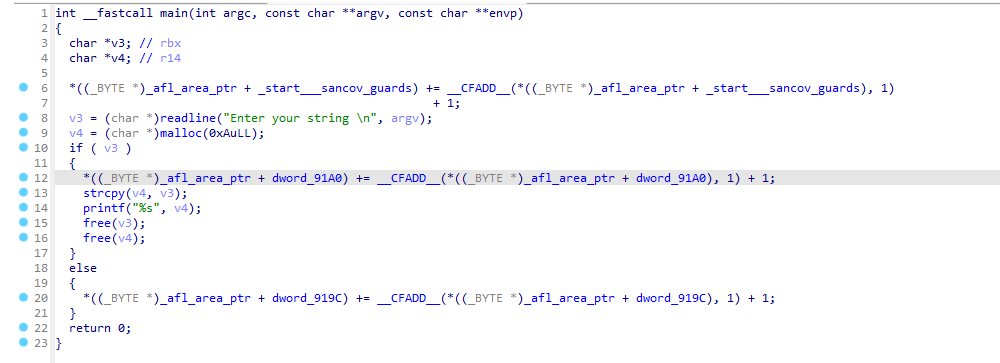

## От автора 
Написание этой статьи было вызвано отсутствием комплексных материалов о структуре фаззера AFL++ на русском языке, а также нгеобходиомтью устранить собственные пробелы в знаниях.

На протяжении всей статьи будут приведены ссылки на исходный код, который относится к последней стабильной версии AFL++ 4.30. Всё, что описано в статье, основывается именно на этой версии, но с высокой вероятностью будет актуально как для более старых, так и для более новых версий, так как затрагивает основные механизмы работы этого фаззера.

## Введние 
AFL (American Fuzzy Lop) и его современная версия AFL++ — это один из самых мощных инструментов для поиска уязвимостей в программах. Этот фаззер используется для тестирования разных типов бинарных файлов и стал стандартом фаззинга.

AFL++ — это не просто генератор случайных данных. Он использует метод фаззинга, основанный на покрытии кода (`coverage-based fuzzing`). Основная идея этого подхода заключается в отслеживании тех участков программы, которые исполняются при подаче определенных данных на вход программы. Таким образом, можно понять, какие входные данные активируют конкретные части программы. На основе этой информации AFL++ формирует базу данных входных данных, которая постепенно покрывает весь код программы, а не только ее основные или часто используемые участки - этот процесс называется *мутацией*. Это позволяет находить ошибки даже в тех местах, которые обычно остаются без внимания.


Давайте рассмотрим работу AFL++ на конкретном пример кода:
```C
int main(){
	input = get_in(); функция-заглушка, для получение ввода из файл / stdin или каким-то другим способом.
	if(condition_A){
		...code_A...
	}else if(condition_B){
		...code_B ..
	}else{
		...code_C...
	}
	return 0;
}
```
Предположим, у нас есть определенный набор данных, подав который с помощью функции `get_in()`, мы выполним участок кода `code_C`. 
> Выполнение уникакальной трассы кода будем называть `edge` (или ребро). 
>
> Набор данных, котрый приводит к открытию нового `edge` будем называть `seed` (сид).
> 
> Совокупность `seed'ов` будем называть `corpus` (корпус).
> 
> `Seed`, который приводит к аварийному завершению исследуемой программы, будем называть `crash` (краш / падение).\
> 
> `Seed`, который приводит к зависманию исследуемой программы, будем называть `hangs` (зависание)
> 
>  Совокупность сидов, крашей и зависаний (выходные данные фаззинга), будем называть `артефактами фаззинга`

Теперь предположим, что мы каким-то образом изменяем `seed` (напоминаю, в фаззинге этот процесс называется `мутацией`), получая новый входной файл — `seed_A`. При вводе `seed_A` программа выполняет секцию `code_A`, который ранее не выполнялся. Это новое поведение. 
Зная, что `seed_A` приводит к выполнению нового участка кода `code_A`, мы можем сохранить `seed_A` в нашем корпусе для дальнейших мутаций, чтобы исследовать другие части кода.
Именно этот итеративный процесс поиска новых ребер, за счет изменения данных и работы с ними делает фаззинг на основе покрытия таким мощным подходом.


### Архитектура afl-fuzz

Типичная команда запуска фаззера выглядит примерно так:
```bash
afl-fuzz -i in -o out -- ./bin [@@]
```
Немного подробнее про опции:
- `-i` - путь до директории с начальным (входным) корпусом данным (**Важно!** наборы данных в этой папке не должны приводить к падению или зависанию программы);
- `-o` - путь, куда будут сохраняться выходные данные фаззера (артефакты)
- `--` такими символами разграничиваются опции утилиты `afl-fuzz` и опции исследуемой программы;
- `bin` - путь до исследуемой программы
- `[@@]` - специальная опция afl-fuzz. При отсутствии символов `@@` фаззер будет подавать данные на программу из потока. Если запустить `afl-fuzz`, выставив символы `@@`, то на вход исследуемой программы сиды будут подаваться как файлы.

Итак, немного глубже рассмотрим то, как происходит запуск и работа утилиты `afl-fuzz`:

Когда запускается `afl-fuzz`, выполняется серия функций инициализации. После этого `afl-fuzz` создает дочерний процесс с помощью `fork`. Дочерний же процесс выполняет   запуск исслудемой программы (цели)  с помощью функции `exec`. Однако, фаззинг тестирование **не** начинается в дочернем процессе. Вместо этого дочерний процесс останавливается прямо перед вызовом функции `main` и становится `forkserve'омr`.

Этот `forkserver` создаёт новый дочерний процесс (дочерний процесс дочернего процесса - внука), и уже в этом процессе (внуке) запускается фаззинг тестирование. 
Такой подход связан с тем, что `fork` работает гораздо быстрее, чем `exec`, поэтому резонно запускать фаззинг именно в процессе - внуке, а не в главном или дочернем процессе, ведь такой подход позвляет повысить скорость фаззинг тестирования, что очень важно. 
> Процесс фаззинг тестирования базируется на постоянном перезапуске исследуемой программы (кроме `persistant mode`, но об этом ниже). 
> Зачастую количество запусков исследуемой программы при грамотно написанной фаззинг обертке и компиляции с механизмами `llvm` достигает сотен тысяч в секунду.


Чтобы `afl-fuzz` мог взаимодействовать с бинарным файлом исследуемой программы (будем его так же называть *целевым файлом*), создаются два канала (`pipe`): управляющий канал (`control pipe`) и канал статуса (`status pipe`).

- Управляющий канал находится по адресу `FORKSRV_FD` и используется для отправки сообщений управления в целевой бинарный файл. Этот канал доступен для чтения только целевому бинарному файлу и для записи только `afl-fuzz`.
- Канал статуса находится по адресу `FORKSRV_FD+1` и используется для передачи статусов обратно в `afl-fuzz`. Этот канал доступен для записи только целевому бинарному файлу и для чтения только `afl-fuzz`.

*Управляющий канал используется для передачи управляющих сообщений в целевой бинарный файл.*
*Канал статуса — для отправки ответных сообщений в `afl-fuzz`.*

Теперь, когда у нас есть общее представление о том, как запускается `afl-fuzz`, давайте более подробно разберём почему AFL++ `coverage-based`.

## Инструментация и сбор покрытия кода
Для работы AFL++ бинарный файл должен быть скомпилирован специальным компилятором AFL++. При компиляции происходит инструментация бинарно файла специальными инструкциями AFL++. Это необходимо для того, чтобы фаззер мог отслеживать открытие новых ребер с помощью мутированных данных при фаззинг тестировании. Это и назыается покрытием кода.
Факт открытия нового ребра сохраняется в специальный массив, который называется "картой покрытия" (подробнее о нём будет ниже).

В настоящее время AFL++ позволяет использовать различные системы инструментации кода для дальнейшего сбора покрытия, но наиболее распространнеными являются `PCGUARD` и `LTO`.
Получить доступ к этим инструментациям можно с помощью базовых компиляторов AFL++:
- `PCGUARD` инструментация предоставляется компилятором `afl-clang-fast`.
- `LTO` инструменацтия предоставляется компилятором `afl-clang-lto`.

Об особенностях компиляции и выборе подходящего компилятор подробно рассказывается в [документации](https://github.com/AFLplusplus/AFLplusplus/tree/v4.30c/docs) на AFL++. 
Если коротко, то изменения компилятора так же влияет и на скорость фаззинга. 
Выбор способа инструментирования кода по скорости от лучшего к худшему:
```
LTO (afl-clang-lto) -> LLVM  (afl-clang-fast) -> GCC_plugin (afl-gcc-fast) -> GCC (afl-gcc)
```

Так же различные компиляторы отличаются не только скоростью фаззинга, но и требованием к версии `clang` и `llvm`.

Теперь давайте рассмотрим инструментацию кода на практике. 
Пусть у нас есть простейшая программа, которая принимает и обрабатывает данные из потока ввода:

```C
#include <stdlib.h>
#include <string.h>
#include <stdio.h>
#include <readline/readline.h>
#define SIZE 10

int main()
{
        char *str = readline("Enter your string \n");
        char * array = malloc(SIZE * sizeof(char));
        if(str == NULL)
                return 0;
        strcpy(array, str);
        printf("%s", array);
        free(str);
        free(array);
        return 0;
}
```

Скомпилируем её с инструментацией `PCGUARD`
```bash
afl-clang-fast main.c -lreadline -o bin_fast
```

И декомпилируем получившийся исполняемый файл в IDA PRO:




Внимательный читатель обратит внимание на появищиеся конструкции, которые сопровождает переменная `_afl_area_ptr`.
Помните выше мы ввели термин *карта покрытия*? Так вот - это  `_afl_area_ptr`. 

`_afl_area_ptr` - это массив, к которому осуществляется доступ каждый раз при достижении новой области. Обратите внимание, что есть доступ к `__afl_area_ptr` происходит во всех ветвлениях кода  - в операторе `if` и в операторе `else`.

Давайте внимательнее разберем строки 12 и 20:
```C
12 |  *((_BYTE *)_afl_area_ptr + dword_91A0) += __CFADD__(*((_BYTE *)_afl_area_ptr + dword_91A0), 1) + 1;
20 |  *((_BYTE *)_afl_area_ptr + dword_919C) += __CFADD__(*((_BYTE *)_afl_area_ptr + dword_919C), 1) + 1;
```
`_afl_area_ptr` по определени будем счиать байтовым массивом, поэтому уберем приведение типов.
Метки `dword_91A0` и `dword_919C` в IDA PRO явяются указателями на участок памяти и относятся к массиву нашей карты памяти, что видно далее:


Инструкции с паттерном `*sancov*` являются следствием инструментации компилятора - таким способом выделяется секция данных для карты покрытия по ребрам. 

Наглядно видно, что метки `dword_919C` и `dword_91A0`  идут последовательно друг за другом и инициализируются нулем, а значит метка `dword_919C` явялется нулевым элементом массива карты покрытия, а `dword_91A0` - первым.


Теперь преобразованные строки инструментации кода  выглядят так:
```C
12 |*_afl_area_ptr[1] += __CFADD__(*_afl_area_ptr, 1) + 1;
20 |*_afl_area_ptr[0] += __CFADD__(*_afl_area_ptr, 1) + 1;
```
`__CFADD__` - макрос, который выполняет сложение (в нашем случае с единицей) с учетом переноса.

```C
12 | _afl_area_ptr[1] =_afl_area_ptr[1] + 1 + (__afl_area_ptr[1] == 255 ? 1 : 0);
20 | _afl_area_ptr[0] =_afl_area_ptr[0] + 1 + (__afl_area_ptr[0] == 255 ? 1 : 0);
```

[Исходник](https://github.com/AFLplusplus/AFLplusplus/blob/v4.30c/instrumentation/afl-compiler-rt.o.c#L1406)

Итак, данная строка кода, при её выполнении, инкрементирует значение элемента масива карты покрытия фаззера. 
То есть, в карте покрытия за каждый участок кода отвечает свой элемент массива (напоминаю, что массив байтовый). При открытии нового ребра в определенном учатке происходит увеличения значения определенного элемента массива. Именно так реализовано получение обратной связи фаззером.


Теперь обратим внимание на инструментацию `LTO`, на те же строки 12 и 20:


Инструментация `LTO` очень похожа на `PCGUARD`, за исключением того, что индекс `_afl_area_ptr` заполняется во время компиляции, а не во время выполнения. Это видно на тех же строках 12 и 20 -  здесь уже нет подсчета адреса массива через адреса и метки, вместо этого используется адресация со смещением, где `offset` - смещение, было подсчитано уже во время компиляции и имеет конкретное значение.


### Инструментация кода

Давайте попытаемся разобраться, как вообще происходит инструментация кода. 
Если тезисно, то `AFL++` использует механизмы сбора покрытия кода, предоставляемые `LLVM`

Подробнее об этом можно почитать в [документации](https://clang.llvm.org/docs/SanitizerCoverage.html)

Данный механизм позволяет вставлять специальные вызовы в пользовательские функции на уровне функций, базовых блоков и рёбер. 
Для активации данного механизма необходимо добавить специальные флаги компиляции, благо `AFL++` делает это [самостоятельно](https://github.com/AFLplusplus/AFLplusplus/blob/v4.30c/src/afl-cc.c#L2057), причем добавляет и ряд дополнительных опций: `-fsanitize-coverage=trace-pc-guard,bb,no-prune,pc-table`: 

- `trace-pc-guard`  - инструментация сбора покрытия после **каждого ребра**;
- `bb` - инструментация сбора покрытия после каждого **базового блока**;
- `no-prune` - позвоялет убрать отсчение некоторой информации при сборе покрытия;
- `pc-table` - инструментация создает таблитцу, которая содержит пары [PC (Адрес базового блока.), PCFlags (Флаги, описывающие свойства базового блока)].  Позволяет отслеживать пути выполнения, которые привели к определенному состоянию.

Согласно документации `LLVM` использование таких инструментаций приводит к добавлению специальных вызовов функций в определенные участики кода (в зависимости от выбранного типа инструментации). Также это накладывает на пользователя необходимость [переодпределения](https://clang.llvm.org/docs/SanitizerCoverage.html#:~:text=The%20functions%20__sanitizer_cov_trace_pc_*%20should%20be%20defined%20by%20the%20user.)  реализаций данных функций, что реализовано в AFL++, например [изменение инструментации создания PCs таблицы](https://github.com/AFLplusplus/AFLplusplus/blob/10db3a35cf17600594946edb6662d606bd4e4207/custom_mutators/libfuzzer/FuzzerTracePC.cpp#L548):

```C
void __sanitizer_cov_pcs_init(const uintptr_t *pcs_beg,
                              const uintptr_t *pcs_end) {

  fuzzer::TPC.HandlePCsInit(pcs_beg, pcs_end);

}
```
Или [изменение инструментации сбора покрытия после каждого **ребра**](https://github.com/AFLplusplus/AFLplusplus/blob/v4.30c/instrumentation/afl-compiler-rt.o.c#L1365).


### Инициализация и запуск forkserver

Прежде чем обсуждать процесс инициализации, нам нужно рассмотреть одну из особенностей `ELF`-файлов, известную как `init array`.

Когда исполняемый бинарный файл запускается, функция `main` не вызывается напрямую. Вместо этого выполнение всегда начинается с интерпретатора (обычно это `ld.so`). Интерпретатор выполняет множество ключевых операций по настройке структуры процессов, таких как динамическая линковка. Однако менее известной особенностью интерпретатора является его способность запускать функции инициализации. Эти функции инициализации находятся в секции, называемой `.init_array`. Эта секция содержит массив функций, которые выполняются последовательно, прямо перед вызовом `main`. Это наглядно можно увидеть в коде [glibc](https://github.com/bminor/glibc/blob/9e2ff880f3cbc0b4ec8505ad2ce4a1c92d7f6d56/elf/dl-init.c#L70) и в почитать в [документации](https://www.gnu.org/software/hurd/glibc/startup.html)


Функции в секции `.init_array` зависят от того, был ли бинарный файл скомпилирован с использованием инструментаций `PCGUARD` или `LTO` (однако, как мы убедились выше, в большинстве случаев они остаются одинаковыми).

В процессе обсуждения функций из `.init_array`  нам встретятся различные переменные, переменные окружения и макросы. Для удобства привожу их определения ниже:

**Обычные переменные:**

- `__afl_area_ptr` — Указатель на карту покрытия. [По умолчанию это](https://github.com/AFLplusplus/AFLplusplus/blob/v4.30c/instrumentation/afl-compiler-rt.o.c#L109) `__afl_area_initial`. Размер `__afl_area_initial` [равен](https://github.com/AFLplusplus/AFLplusplus/blob/v4.30c/instrumentation/afl-compiler-rt.o.c#L105) `MAP_INITIAL_SIZE`.
- `__afl_final_loc` — Последний индекс в `__afl_area_ptr`, к которому был осуществлен доступ при помощи инструментации. По сути это конец массива карты покрытий. 
- `__afl_map_addr` — Адрес, по которому карта покрытия будет отображена через mmap. Эта переменная существует только в случае, если `AFL_LLVM_MAP_ADDR` установлен в режиме `LTO`. В противном случае её значение равно 0.
- `__afl_map_size` — Размер карты покрытия.
- `__afl_area_initial` — указатель на массив, который является картой покрытия и используется в общей (разделяемой) памяти между инстансами `afl-fuzz`.

**Переменные окружения:**

- `__AFL_SHM_ID` ([алиас](https://github.com/AFLplusplus/AFLplusplus/blob/v4.30c/include/config.h#L405) на  `SHM_ENV_VAR`) — Идентификатор общей памяти для карты покрытия.
- `__AFL_SHM_FUZZ_ID` ([алиас](https://github.com/AFLplusplus/AFLplusplus/blob/v4.30c/include/config.h#L409) `SHM_FUZZ_ENV_VAR`) — Идентификатор общей памяти для фаззинга через общую память.
- `AFL_MAP_SIZE` — Используется для задания размера буфера общей памяти, выделяемого `afl-fuzz`.

**Макросы:**

- `MAP_SIZE` — Пользовательское значение, которое `afl-fuzz` будет использовать для задания размера карты покрытия общей памяти. изначально [зависит от системы](https://github.com/AFLplusplus/AFLplusplus/blob/v4.30c/include/config.h#L405)
- `MAP_INITIAL_SIZE` — Размер `__afl_area_initial`.


Теперь начнем с `PCGUARD`. Функции инициализации выглядят следующим образом:


Все эти функции (за исключением `sancov.module_ctor_trace_pc_guard`) можно найти в [исходниках](https://github.com/AFLplusplus/AFLplusplus/blob/v4.30c/instrumentation/afl-compiler-rt.o.c)

Итак, пойдем по порядку:

1. `__afl_auto_first` - она по сути [ничего не делает](https://github.com/AFLplusplus/AFLplusplus/blob/v4.30c/instrumentation/afl-compiler-rt.o.c#L1337), только устанавливает `__afl_already_initialized_first = 1`, чтобы показать, что  был запущен процесс инициализации и проверяет наличие LLVM инструментации.
2. `__afl_auto_second` - сравнивает `__afl_final_loc` и `MAP_INITIAL_SIZE`. Если первый параметр меньше второго, то выделяет доп.память и обновляет все указатели, связанные с [картой покрытия](https://github.com/AFLplusplus/AFLplusplus/blob/v4.30c/instrumentation/afl-compiler-rt.o.c#L1390)
3. `sancov.module_ctor_trace_pc_guard` - просто обернутый вызов функции `__sanitizer_cov_trace_pc_guard_init`.
   


**Рассмотрим функцию** `__sanitizer_cov_trace_pc_guard_init` более [подробно](https://github.com/AFLplusplus/AFLplusplus/blob/v4.30c/instrumentation/afl-compiler-rt.o.c#L1722):

```C
void __sanitizer_cov_trace_pc_guard_init(uint32_t *start, uint32_t *stop) {

  u32   inst_ratio = 100;
  char *x;

  _is_sancov = 1;

...

  if (start == stop || *start) return;

	...

   if (__afl_final_loc < 4) __afl_final_loc = 4;  // we skip the first 5 entries

  *(start++) = ++__afl_final_loc; //start at 4

  while (start < stop) {

    if (likely(inst_ratio == 100) || R(100) < inst_ratio)
      *start = ++__afl_final_loc;
    else
      *start = 0;  // write to map[0]

    start++;

  }
...
```

Эта функция принимает два параметра: `start` и `end`, которые обозначают начало и конец массива меток защиты (guards, как показано в приведённом выше примере). Эти метки фактически составляют карту покрытия - массив состояний покрытия ребер кода.

Суть работы функции заключается в следующем: она последовательно проходит через всю карту покрытия, заполняя её индексами и одновременно увеличивая значение переменной `__afl_final_loc`. В результате выполнения `__afl_final_loc` принимает значение последнего индекса, соответствующего концу массива карты покрытия.

Напомню, что метки защиты (`guards`) привязаны к определённым участкам кода. Эти метки:
- Хранятся в массиве, который фактически является частью карты покрытия.
- Выступают в роли уникальных идентификаторов для различных участков кода.

В тестовом примере из начала статьи такими метками выступали `dword_91A0` и `dword_919C`.

Пара слов об этой строке кода:
```
if (likely(inst_ratio == 100) || R(100) < inst_ratio)
```
Функция `likely` — это макрос или встроенная функция, обычно предоставляемая компилятором. Она помогает оптимизировать выполнение кода, указывая компилятору, что определённое условие с *высокой вероятностью* истинно. В данном случае:

```C
likely(inst_ratio == 100)
```
Указывает, что в большинстве случаев переменная `inst_ratio` будет равна `100`. Это помогает компилятору оптимизировать ветвление для данного условия

`R(100)` — это макрос или функция, которая возвращает случайное число от 0 до 99 (включительно).

Если `inst_ratio == 100`, все метки защиты активируются.
Если `inst_ratio < 100`, метки активируются случайным образом с вероятностью, равной `inst_ratio`.


**Следующая функция** — `__afl_auto_early`. [Эта функция](https://github.com/AFLplusplus/AFLplusplus/blob/v4.30c/instrumentation/afl-compiler-rt.o.c#L1277) вызывает в себе функцию `__afl_map_shm`.

Для дальнешего обсуждения работы этой функции необходимо пару слов сказать про *разделяему память*. 

> Разделяемая память — это механизм в Linux, который позволяет создавать области памяти, доступные для нескольких процессов. Каждая область разделяемой памяти имеет собственный уникальный идентификатор (ID), который ее идентифицирует. Чтобы два процесса могли получить доступ к одной и той же разделяемой памяти, им нужно только сопоставить память с одинаковым ID. Для более подробной информации о разделяемой памяти рекомендуется обратиться к странице [руководства](https://man7.org/linux/man-pages/man7/shm_overview.7.html)

По сути, `afl-fuzz` создает экземпляр разделяемой памяти, а целевой процесс сопоставляет дескриптор этой памяти с картой покрытия. В результате `afl-fuzz` может видеть любые изменения, которые дочерний процесс вносит в карту покрытия.


Функция вышла достаточно объемной, поэтому было решение объяснить её работу через комментарии.
Из функции также вырезаны отладочные сообщения, режим CMPlog и режим частичной инструментации кода, а также обработка некоторых ошибок. Полный код функции доступен [тут](https://github.com/AFLplusplus/AFLplusplus/blob/v4.30c/instrumentation/afl-compiler-rt.o.c#L349)

```C
static void __afl_map_shm(void) {

  // Если разделяемая память уже инициализирована, выходим
  if (__afl_already_initialized_shm) return;
  __afl_already_initialized_shm = 1;

  // Если указатель карты покрытия не установлен, используем заглушку
  if (!__afl_area_ptr) { __afl_area_ptr = __afl_area_ptr_dummy; }

  // Получаем идентификатор разделяемой памяти из переменной окружения
  char *id_str = getenv(SHM_ENV_VAR);

  // Проверяем финальное местоположение карты покрытия
  if (__afl_final_loc) { // !<----------- максмальный размер массива карты покрытия
    __afl_map_size = ++__afl_final_loc;  // Увеличиваем, так как отсчет начинается с 0

     // Если размер больше допустимого MAP_SIZE, предупреждаем пользователя
   if (__afl_final_loc > MAP_SIZE) {
      char *ptr;
      u32 val = 0;
      if ((ptr = getenv("AFL_MAP_SIZE")) != NULL) { val = atoi(ptr); }
      if (val < __afl_final_loc) {
        if (__afl_final_loc > MAP_INITIAL_SIZE && !getenv("AFL_QUIET")) {
          fprintf(stderr,
                  "Warning: AFL++ tools might need to set AFL_MAP_SIZE to %u "
                  "to be able to run this instrumented program if this "
                  "crashes!\n",
                  __afl_final_loc);
        }
      }
    }
  }

  
  // Проверяем, запущено ли приложение под управлением afl-fuzz
  if (__afl_sharedmem_fuzzing && (!id_str || !getenv(SHM_FUZZ_ENV_VAR) ||
                                  fcntl(FORKSRV_FD, F_GETFD) == -1 ||
                                  fcntl(FORKSRV_FD + 1, F_GETFD) == -1)) {
    __afl_sharedmem_fuzzing = 0;
  }

  // Если ID разделяемой памяти отсутствует, инициализируем значения по умолчанию
  if (!id_str) {
   ...
  }

  // Если приложение запущено под AFL++, привязываем карту покрытия
  if (id_str) {
    if (__afl_area_ptr && __afl_area_ptr != __afl_area_initial &&
        __afl_area_ptr != __afl_area_ptr_dummy) {
      if (__afl_map_addr) {
        munmap((void *)__afl_map_addr, __afl_final_loc);  // Освобождаем предыдущую память
      } else {
        free(__afl_area_ptr);  // Освобождаем старую память
      }
      __afl_area_ptr = __afl_area_ptr_dummy;  // Сбрасываем указатель
    }

    // Преобразуем строковый ID в числовой
    u32 shm_id = atoi(id_str);

    // Проверяем, соответствует ли размер карты
    if (__afl_map_size && __afl_map_size > MAP_SIZE) {
      u8 *map_env = (u8 *)getenv("AFL_MAP_SIZE");
      if (!map_env || atoi((char *)map_env) < MAP_SIZE) {
        fprintf(stderr, "FS_ERROR_MAP_SIZE\n");
        send_forkserver_error(FS_ERROR_MAP_SIZE);
        _exit(1);
      }
    }

//-----------------Здесь происходит вся магия---------------
    // Привязываем разделяемую память
    __afl_area_ptr = (u8 *)shmat(shm_id, (void *)__afl_map_addr, 0);

    // Обрабатываем ошибки привязки
    if (!__afl_area_ptr || __afl_area_ptr == (void *)-1) {
      if (__afl_map_addr)
        send_forkserver_error(FS_ERROR_MAP_ADDR);
      else
        send_forkserver_error(FS_ERROR_SHMAT);

      perror("shmat for map");
      _exit(1);
    }

    // Записываем что-либо в карту, чтобы AFL не прекращал работу
    __afl_area_ptr[0] = 1;

   ...
  }

  // Сохраняем резервный указатель на карту
  __afl_area_ptr_backup = __afl_area_ptr;

...
}
```

> Наглядно видно, что основная работа с разделяемой памятью происходит в функции shmat. Подробнее можно прочитать [здесь](https://www.opennet.ru/man.shtml?topic=shmat&category=2&russian=0)

Выполнения данной функции приводит к тому, что `__afl_area_ptr` настроен и располагается в разделяемой (общей) памяти и доступен для всех потомков процесса `afl-fuzz`